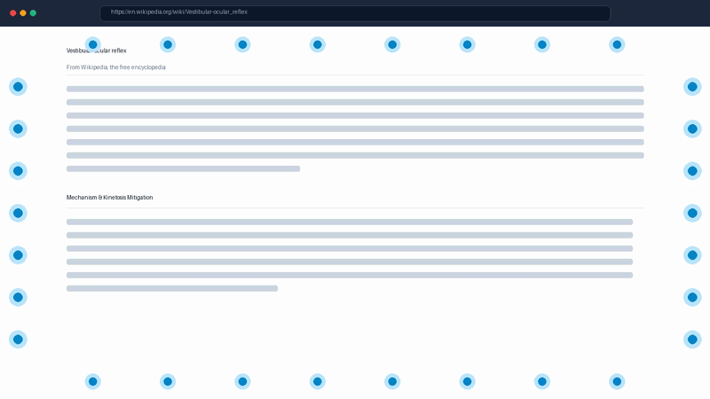
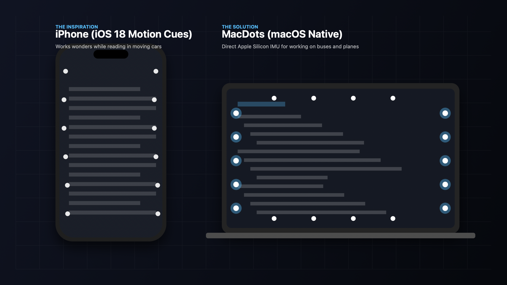

# MacDots: Vehicle Motion Cues for macOS

[](LICENSE)
[]()
[-orange.svg)]()

> Work on the bus, train, or airplane without motion sickness.
> MacDots brings the clinical research behind visual vestibular-ocular alignment to macOS, utilizing the Mac's internal MEMS accelerometer and gyroscope to render real-time, non-intrusive peripheral motion cues.



---

## The Motivation

I use Apple's **Vehicle Motion Cues** on my iPhone every single time I am a passenger in a car, bus, or train. It completely transformed road trips for me: where I used to get nauseous within five minutes of looking at my phone, I could suddenly read comfortably for hours.

However, whenever I opened my MacBook to write code, review documents, or answer emails on the road or in the air, the nausea immediately returned. macOS had no native equivalent to Vehicle Motion Cues. 

I built **MacDots** to bring that same life-changing capability to the Mac. By tapping directly into the undocumented Apple Silicon MEMS inertial sensor (100 Hz IOKit HID stream), MacDots displays smooth, physics-based visual motion cues along your display borders so you can stay productive anywhere without motion sickness.



---

## Key Features

- **Direct Apple Silicon MEMS IMU:** Interfaces directly with the MacBook's internal `AppleSPUHIDDevice` (Bosch BMI286 or equivalent IMU) via unprivileged IOKit HID at **100 Hz** with sub-millisecond latency.
- **100% Click-Through Overlay:** Non-activating, transparent overlay panels (`.ignoresMouseEvents = true`, `.canJoinAllSpaces`) float smoothly above all full-screen workspaces, Xcode, browsers, and terminals without ever intercepting clicks or keystrokes.
- **Sleek Vector Menu Bar Icon:** High-DPI Retina template icon depicting screen-edge motion cues and a horizon stabilizer that natively adapts to dark and light macOS menu bars.
- **Anticipatory Jerk Feed-Forward:** Evaluates the rate of change of acceleration (`da/dt`) to shift dots 120ms ahead of peak lateral forces, mimicking the neurological anticipatory model that prevents vehicle drivers from feeling sick.
- **Artificial Horizon Roll Tilt:** Tilts peripheral cues dynamically with the vehicle's banking angle (`arctan(ax / g)`), anchoring the vestibular-ocular reflex to the true inertial horizon.
- **3D Optic Flow Expansion:** Expands dots outward toward display corners during forward acceleration and contracts inward during braking, stimulating visual cortex MT/MST vection pathways.
- **Dynamic Anti-Nausea Vignette:** Softly darkens the outermost 4% of display edges during aggressive maneuvers (>0.22g) or sudden turbulence chops to mitigate sensory overload.
- **Autonomic Vagal Calming Mode:** Pulses dots with a soothing 0.1 Hz respiratory rhythm (6 breaths per minute) when stopped at traffic lights or airport gates to calm sympathetic nausea triggers.
- **Realistic Vehicle Simulator:** Includes built-in physics profiles for immediate desk testing:
  - **City Bus:** Stop-and-go acceleration, heavy bus stop braking, sharp 90-degree cornering, pavement bumps.
  - **Commercial Airplane:** High-altitude cruise, atmospheric turbulence chops, banking coordinated turns.
  - **Train / Subway:** Rhythmic rail track sway (hunting oscillations), rail switch crossing jolts.
  - **Highway Car:** High-speed double lane changes, sweeping curves, engine hum.
  - **Winding Mountain Road:** Continuous alternating S-curves and elevation grade transitions.
- **Interactive Web Edition:** Includes a standalone web companion in `web/index.html` with HTML5 device motion sensor support for phones, tablets, or cross-platform testing.
- **Aviation HUD Diagnostics:** Real-time 2D crosshair G-meter, dual-channel oscilloscope waveform graphs, and instant maneuver test triggers.

---

## The Science: Why You Get Motion Sickness and How MacDots Helps

### 1. The Vestibular-Ocular Sensory Conflict
When working on a laptop inside a moving vehicle, your inner ear's vestibular organs (otoliths and semicircular canals) register physical turns, acceleration, braking, and turbulence. Meanwhile, your eyes, focused on a static screen of code or text, report zero relative motion. This disagreement is known as **Sensory Conflict Theory** (Reason and Brand, 1975).

### 2. Treisman's Evolutionary Poison Hypothesis
Under evolutionary biology (Treisman, 1977), sensory mismatch between the inner ear and vision historically only occurred after ingesting neurotoxic alkaloids. In response, the brain's chemoreceptor trigger zone induces nausea and cold sweats as an evolutionary defense mechanism to evacuate toxins.

### 3. Peripheral Vision Exploitation (The Magnocellular Pathway)
The central fovea (0-5 degrees) is responsible for sharp reading and coding. The retinal periphery (>20 degrees) is dominated by magnocellular (M) neurons that process motion flow and spatial orientation. MacDots places animated cues strictly along the **perimeter borders of your screen**, leaving your entire workspace unobstructed while feeding your peripheral retina the motion flow it needs to stay in sync with your inner ear.

### 4. Keystroke Rejection (ISO 2631-1)
Human motion sickness susceptibility peaks at low frequencies (**0.16 Hz to 0.25 Hz**). Typing on a MacBook keyboard produces mechanical vibrations between **15 Hz and 50 Hz**. MacDots uses a **2nd-Order Butterworth Low-Pass Filter (2.2 Hz cutoff)** and an **Adaptive Leaky-Integrator Gravity Estimator** to eliminate typing noise and auto-calibrate for any laptop screen angle.

---

## Setup and Quick Start

### Option 1: Run the Pre-Built App Bundle
```bash
git clone https://github.com/ashayas/macdots.git
cd macdots
open MacDots.app
```

### Option 2: Build from Source
Requirements: macOS 14.0 or later, Apple Silicon (M1, M2, M3, M4, M5).

```bash
# Clone the repository
git clone https://github.com/ashayas/macdots.git
cd macdots

# Compile the release binary and bundle the application
./build_app.sh

# Launch MacDots
open MacDots.app
```

### Option 3: Swift Package Manager
```bash
swift run -c release
```

---

## Web Version

To try the web version on any browser or mobile device:
```bash
open web/index.html
```
Or serve it via any static HTTP server:
```bash
python3 -m http.server 8080 --directory web
```
On mobile devices with motion sensors, select **Device Sensors** from the dropdown to experience real-time tilt and acceleration cues.

---

## Controls and Navigation

| Action | Control |
| :--- | :--- |
| **Global Toggle** | Press `Ctrl + Option + Cmd + M` (`^⌥⌘M`) from anywhere |
| **Menu Bar Access** | Click the display icon in the top macOS menu bar |
| **Sensor Mode** | Toggle between **Hardware IMU** and **Vehicle Simulator** |
| **Diagnostics HUD** | Menu Bar -> **Live Telemetry & Diagnostics...** |
| **Preferences** | Menu Bar -> **Preferences & Research...** |

---

## Repository Structure

```
macdots/
├── Sources/
│   ├── main.swift                   # AppKit entry point with accessory activation policy
│   ├── App/
│   │   ├── AppDelegate.swift        # NSStatusItem, NSPopover, hotkey monitors, window routing
│   │   └── AppState.swift           # Central state coordinator and user preferences
│   ├── Sensors/
│   │   ├── MotionData.swift         # Vector3 math, MotionSample, VehicleProfile models
│   │   ├── MotionSensorProtocol.swift
│   │   ├── AppleSiliconIMU.swift    # IOKit HID driver for AppleSPUHIDDevice (100 Hz)
│   │   ├── MotionSimulator.swift    # Kinematic vehicle simulation engine
│   │   └── SensorManager.swift      # Hardware and software sensor coordinator
│   ├── Filters/
│   │   ├── BiquadFilter.swift       # 2nd-order Butterworth low-pass and high-pass IIR filters
│   │   └── MotionProcessor.swift    # Jerk feed-forward, gravity auto-leveling, and vagal pulse
│   ├── Physics/
│   │   ├── DotParticle.swift        # Individual particle model with rest anchor and velocity
│   │   └── DotPhysicsEngine.swift   # Symplectic Euler spring-mass-damper simulation (60-120 Hz)
│   └── UI/
│       ├── OverlayWindowManager.swift # Multi-screen transparent click-through NSPanel controller
│       ├── OverlayDotCanvas.swift   # High-performance ProMotion SwiftUI Canvas renderer
│       ├── Theme/
│       │   └── DesignSystem.swift   # Glassmorphic cards, status pills, tactile sliders
│       ├── MenuBar/
│       │   ├── MenuBarIcon.swift    # Custom vector Retina menu bar template icon
│       │   └── MenuBarView.swift    # Menu bar popover with mini G-meter and theme swatches
│       ├── Diagnostics/
│       │   └── DiagnosticsWindow.swift # Aviation HUD, oscilloscope, and test impulses
│       ├── Settings/
│       │   └── SettingsWindow.swift # Preferences with live preview canvas and research toggles
│       └── Components/
│           ├── GMeterView.swift     # 2D crosshair G-meter
│           └── WaveformGraph.swift  # Real-time scrolling telemetry waveform
├── web/
│   └── index.html                   # Standalone interactive web edition
├── docs/
│   ├── demo.gif                     # Animated demonstration over clean research view
│   ├── demo.mp4                     # Demonstration video
│   └── iphone_motion_cues.png       # Motivation infographic (iPhone vs MacDots)
├── Package.swift
├── build_app.sh                     # Automated release compilation and .app bundler
├── AppIcon.icns                     # High-resolution macOS application icon
└── LICENSE                          # MIT License
```

---

## Clinical and Academic References

1. Reason, J. T., and Brand, J. J. (1975). *Motion Sickness.* Academic Press.
2. Treisman, M. (1977). *Motion sickness: an evolutionary hypothesis.* Science, 197(4302), 493-495.
3. Griffin, M. J. (1990). *Handbook of Human Vibration.* Academic Press.
4. ISO 2631-1:1997. *Mechanical vibration and shock: Evaluation of human exposure to whole-body vibration.*
5. Golding, J. F. (2006). *Motion sickness susceptibility.* Autonomic Neuroscience, 129(1-2), 67-76.
6. Diels, C., and Bos, J. E. (2016). *Self-driving cars: an ergonomics perspective on motion sickness.* Applied Ergonomics.
7. Kunze, K., et al. (2021). *Dynamic Peripheral Vision Blocking for Reducing Motion Sickness Symptoms.* IEEE VR.
8. Kuiper, O. X., et al. (2018). *Looking forward: In-vehicle auxiliary display positioning affects carsickness.* Applied Ergonomics.

---

## License

MacDots is open-source software licensed under the [MIT License](LICENSE).
